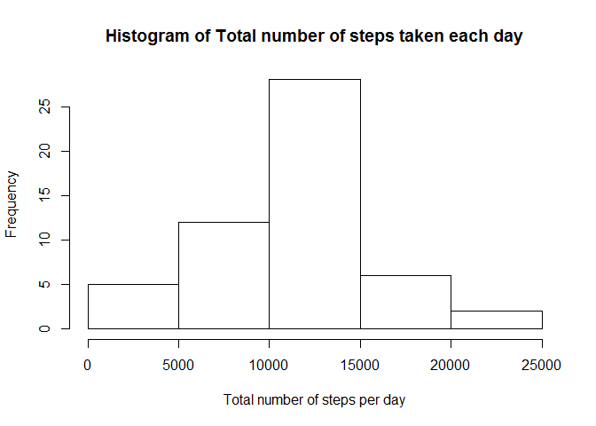
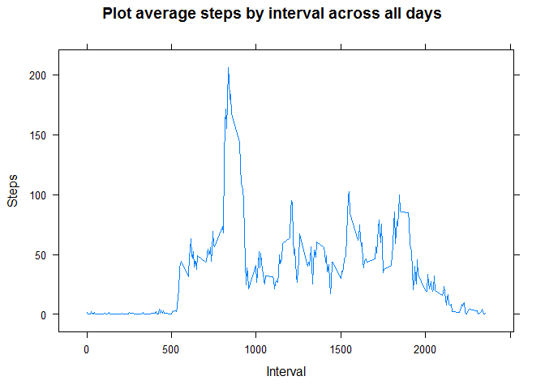
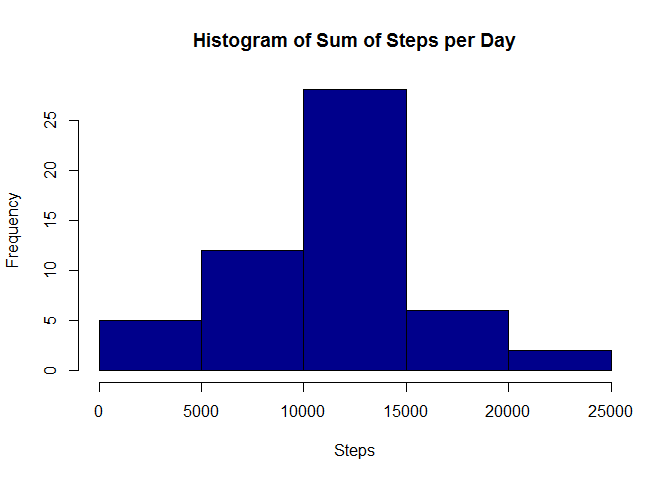
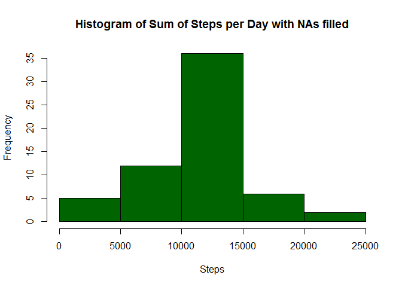
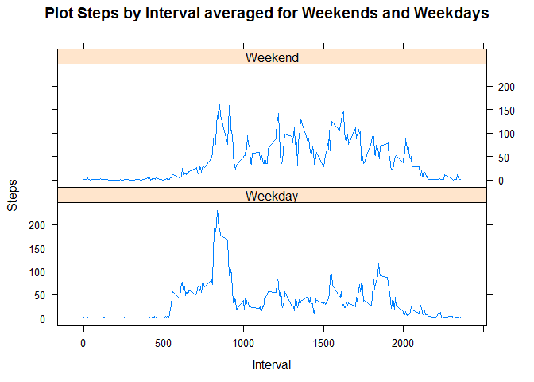

# Reproducible Research: Peer Assessment 1


## Loading and preprocessing the data
Show any code that is needed to

        1. Load the data (i.e. read.csv())
        
        2. Process/transform the data (if necessary) into a format suitable for your analysis

```r
        library(ggplot2);
```

```
## Warning: package 'ggplot2' was built under R version 3.1.1
```

```r
        library(lattice);
```

```
## Warning: package 'lattice' was built under R version 3.1.1
```

```r
        ## This assumes that you have unzipped the activity.zip file
        mydata <- read.csv("./activity.csv");  
```

## What is mean total number of steps taken per day?
For this part of the assignment, you can ignore the missing values in the dataset.

        1. Make a histogram of the total number of steps taken each day
        
        2. Calculate and report the mean and median total number of steps taken per day

```r
        ## Calculate the total number of steps taken on each day
        sumperday <- aggregate(mydata$steps, list(date=mydata$date), FUN=sum);
        ## plot a histogram of this data
        hist(sumperday$x, xlab="Total number of steps per day", main="Histogram of Total number of steps taken each day");
```

 

```r
        print(paste("Mean total number of steps taken per day:", as.character(as.integer(mean(sumperday$x, na.rm=TRUE)))));
```

```
## [1] "Mean total number of steps taken per day: 10766"
```

```r
        print(paste("Median total number of steps taken per day:", as.character(as.integer(median(sumperday$x, na.rm=TRUE)))));
```

```
## [1] "Median total number of steps taken per day: 10765"
```


#### ANALYSIS: As can be seen above the mean and median total number of steps taken per day is the same


## What is the average daily activity pattern?
        1. Make a time series plot (i.e. type = "l") of the 5-minute interval (x-axis) and the average number of steps taken, averaged across all days (y-axis)
        2. Which 5-minute interval, on average across all the days in the dataset, contains the maximum number of steps?

```r
        ## remove all the NAs frm the data
        mydata_noNAs <- mydata[which(!is.na(mydata$steps)),]

        ## use aggregate to calculate the mean number of steps taken by interval across all days
        meanperinterval <- aggregate (mydata_noNAs$steps, list(interval=mydata_noNAs$interval), mean);
        ## line plot  
        xyplot (meanperinterval$x ~ meanperinterval$interval, type="l", xlab="Interval", ylab="Steps", main="Plot average steps by interval across all days")
```

 

```r
        ## Find and print the interval which has the maximum number of mean steps taken across all the days
        intervalwithMaxMeanSteps <- meanperinterval$interval[which(meanperinterval$x == max(meanperinterval$x))];
        print (paste("5-minute interval which has max numner of steps on average across all the days: ", intervalwithMaxMeanSteps));       
```

```
## [1] "5-minute interval which has max numner of steps on average across all the days:  835"
```


#### ANALYSIS: Based on the plot, it looks like the most activity across all the days tends to happen approximately between intervals 750-1000 


## Imputing missing values
Note that there are a number of days/intervals where there are missing values
(coded as NA). The presence of missing days may introduce bias into some
calculations or summaries of the data.

        1. Calculate and report the total number of missing values in the dataset (i.e. the total number of rows with NAs)
        
        2. Devise a strategy for filling in all of the missing values in the dataset. The strategy does not need to be sophisticated. For example, you could use the mean/median for that day, or the mean for that 5-minute interval, etc.
        
        3. Create a new dataset that is equal to the original dataset but with the missing data filled in.
        
        4. Make a histogram of the total number of steps taken each day and Calculate and report the mean and median total number of steps taken per day. Do these values differ from the estimates from the first part of the assignment? What is the impact of imputing missing data on the estimates of the total daily number of steps?
        

```r
        ## Find and print total number of rows which have NAs
        num_NA_rows <- sum(is.na(mydata$steps));
        print(paste("Number of rows with NA: ", num_NA_rows));
```

```
## [1] "Number of rows with NA:  2304"
```

```r
        ## Fill the NAs in the Steps column with the average value for the particula interval across all the days
        filleddata <- mydata
        for (i in 1:nrow(filleddata)){
                if(is.na(filleddata$steps[i])){
                        filleddata$steps[i] <- meanperinterval$x[which(filleddata$interval[i] == meanperinterval$interval)];
                }
        }
        ## use this filled data to compute the sum, mean and median nuumber of steps and plot them in a comparison with the data without the fills
        filled_sumperday <- aggregate(filleddata$steps, list(date=filleddata$date), sum);
        filledmeanperday <- aggregate(filleddata$steps, list(date=filleddata$date), FUN=mean);
        filledmedianperday <- aggregate(filleddata$steps, list(date=filleddata$date), FUN=median);

        hist(sumperday$x,  xlab="Steps", main="Histogram of Sum of Steps per Day", col="dark blue");
```

 

```r
        hist(filled_sumperday$x, xlab="Steps", main="Histogram of Sum of Steps per Day with NAs filled", col="dark green");
```

 

```r
        print(paste("Mean total number of steps taken per day:", as.character(as.integer(mean(filled_sumperday$x, na.rm=TRUE)))));
```

```
## [1] "Mean total number of steps taken per day: 10766"
```

```r
        print(paste("Median total number of steps taken per day:", as.character(as.integer(median(filled_sumperday$x, na.rm=TRUE)))));
```

```
## [1] "Median total number of steps taken per day: 10766"
```


#### ANALYSIS: By filling the NAs with average steps taken across all the days for the same interval, in this case, the sum of steps by day has gone up and hence the histogram shows taller bar for 10000-15000 (35% vs <30%) but as expected the Mean and Median continue to be the same as before.


## Are there differences in activity patterns between weekdays and weekends?
For this part the weekdays() function may be of some help here. Use the dataset with the filled-in missing values for this part.

        1. Create a new factor variable in the dataset with two levels - "weekday" and "weekend" indicating whether a given date is a weekday or weekend day.
        
        2. Make a panel plot containing a time series plot (i.e. type = "l") of the 5-minute interval (x-axis) and the average number of steps taken, averaged across all weekday days or weekend days (y-axis). The plot should look something like the following, which was creating using simulated data:
        

```r
        ## Create an additional column called weekday and populate it with the day of the week first and then with the words "weekday" or "weekend" depending on the day of the week

        filleddata$weekday <- filleddata$date
        filleddata$weekday <- weekdays(as.Date(as.character(filleddata$weekday)), abbreviate=FALSE)
        for (i in 1:nrow(filleddata)){
                if (filleddata$weekday[i] == "Saturday" | filleddata$weekday[i] == "Sunday"){
                        filleddata$weekday[i] <- "Weekend"        
                } else { filleddata$weekday[i] <- "Weekday"}
        }
        filleddata$weekday <- as.factor(filleddata$weekday)
        
        ## use aggregate to compute the mean of steps based on interval and weekday-or-weekend
        plotdata <- aggregate(filleddata$steps, list(interval=filleddata$interval, weekday=filleddata$weekday), FUN=mean);
        ## plot the steps based by interval in two panels - one each for weekday and weekend
        xyplot (plotdata$x ~ plotdata$interval | plotdata$weekday, layout =c(1,2), type="l", xlab="Interval", ylab="Steps", main="Plot Steps by Interval averaged for Weekends and Weekdays")       
```

 


#### ANALYSIS: The plots point out to couple of things - 1. Weekend has less activity between intervals 500-750 (likely people sleep longer on weekends) and 2. Weekend has more activity between intervals 1000-2000 (likely because on weekdays people work in offices at their desks and have lesser activity)

